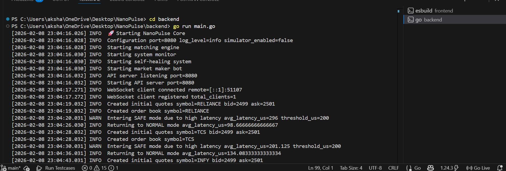

# 🚀 NanoPulse — Low-Latency Matching & Market Making Engine  

NanoPulse is a **Go-based exchange-style matching engine and order management system (OMS)** designed to simulate real-world trading infrastructure.  

It models a production-grade trading environment with:  
- Order lifecycle management  
- Central limit order book (CLOB)  
- Real-time matching engine  
- Latency monitoring with safety controls  
- Automated market maker (liquidity provider)  
- REST + WebSocket interfaces  
- Event-driven, concurrent architecture  

---

## 🏗️ High-Level Architecture  


**Order Flow:**  
1. User submits order via REST/WebSocket  
2. API layer validates & normalizes the request  
3. Safety monitor checks system health & latency  
4. Matching engine attempts immediate execution  
5. Unmatched orders rest in the order book  
6. Trades are broadcast in real time  

---

## 🔥 Live Engine Demo (Logs)  



You can see in the logs:  
- WebSocket connections  
- Order book creation  
- Latency spikes triggering **SAFE mode**  
- Trade executions  
- Automatic recovery to **NORMAL mode**

---

## ⚙️ Core Components  

### 1️⃣ API Layer (Gateway)
- REST endpoint for placing orders  
- WebSocket for real-time updates  
- Request validation and routing  

### 2️⃣ Monitoring & Safety Engine  
- Tracks average and peak latency  
- Automatically switches to **SAFE mode** under high latency  
- Self-healing recovery back to NORMAL mode  

### 3️⃣ Matching Engine (Core)
- Implements price-time priority matching  
- Supports multiple symbols  
- Handles partial fills  

### 4️⃣ Order Book (CLOB)
- Maintains best bid / best ask  
- In-memory data structures  
- Supports insert, cancel, and match  

### 5️⃣ Market Maker Bot  
- Provides continuous liquidity  
- Posts dynamic bid/ask quotes  

### 6️⃣ Trade Broadcaster  
- Streams executions to clients  
- Updates order book state in real time  

---

## 🧠 Technical Design Principles  

| Principle | How NanoPulse Implements It |
|------------|----------------------------|
| Low latency | Goroutines + channels |
| Concurrency | Message passing |
| Event-driven | Asynchronous processing |
| Resilience | SAFE mode + self-healing |
| Modularity | Clear separation of concerns |
| Observability | Structured timestamped logs |

---

## 📁 Project Structure  

```
NanoPulse/
│── backend/
│   ├── cmd/
│   │   └── server/main.go
│   ├── internal/
│   │   ├── engine/
│   │   ├── orderbook/
│   │   ├── marketmaker/
│   │   └── monitor/
│   └── api/
│
│── frontend/   
│── docs/
│── README.md

```

---

## ▶️ Running the System  

### Start backend  
```bash
cd backend
go run main.go
```

### Place an example order  
```bash
curl -X POST http://localhost:8080/order \
-H "Content-Type: application/json" \
-d '{"symbol":"RELIANCE","side":"BUY","price":2501,"qty":10}'
```

Possible outcomes:  
- Immediate trade  
- Partial fill  
- Order resting in book  

---

## 🎯 What this project demonstrates  

NanoPulse showcases:  
- End-to-end order lifecycle  
- Real-time matching engine design  
- Latency-aware safety controls  
- WebSocket streaming in Go  
- Concurrent, event-driven system design  


## 👤 Author  
**Akshat Madhani**  
GitHub: @AkshatMadhani  
